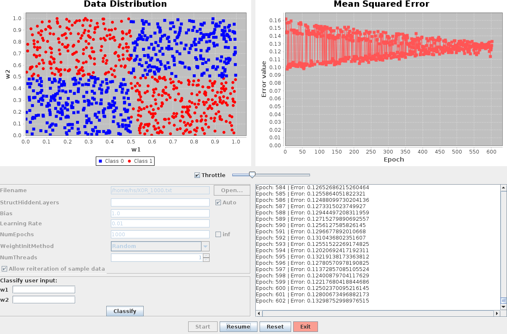

## GUI Config

**``Filename``** File containing training dataset

**``StructHiddenLayers``** Structure of hidden layers in form ``x,y,z,...`` where x,y,z are the number of neurons in the layers at positions 1,2,3

**``Bias``**, **``LearningRate``** self-explanatory

**``NumEpochs``** Limits the number of epochs the net should perform

**``WeightInitMethod``** How the weights should be initialized at net creation

**``NumThreads``** How many CPU cores/threads the learning process should use

**``Allow reiteration of sample data``** If one single dataset is allowed to be re-visited during the learning process

> **NOTE**: To parse the whole dataset exactly once, set ``Num Epochs`` to ``inf`` and uncheck ``Allow reiteration of sample data``.

**``Throttle``** Throttles the training process. Can be adjusted at any time.

<br>

## Training file syntax

```
a b x
c d y
...
```

Where ``a, b, c, d`` are input values and ``x, y`` are the target classes {0, 1}.

## Examples



